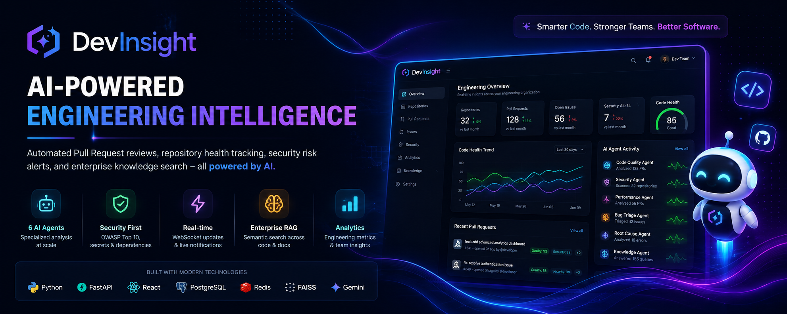
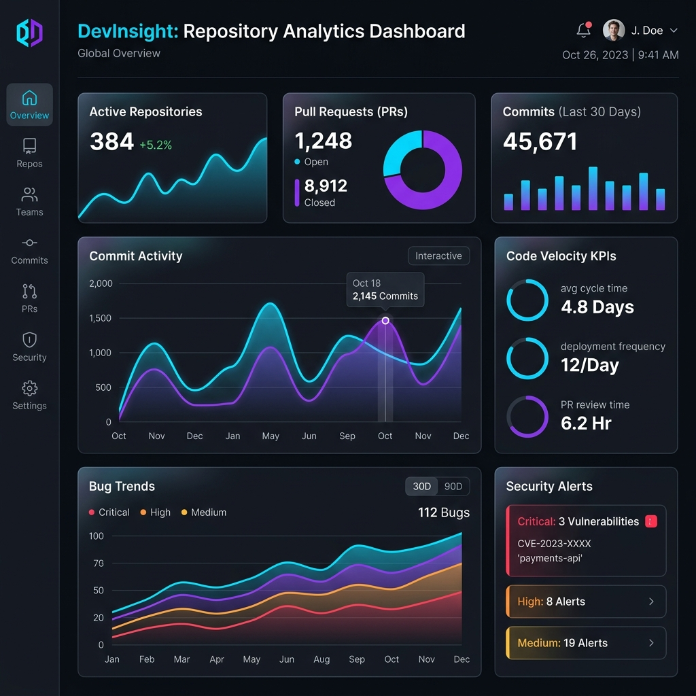
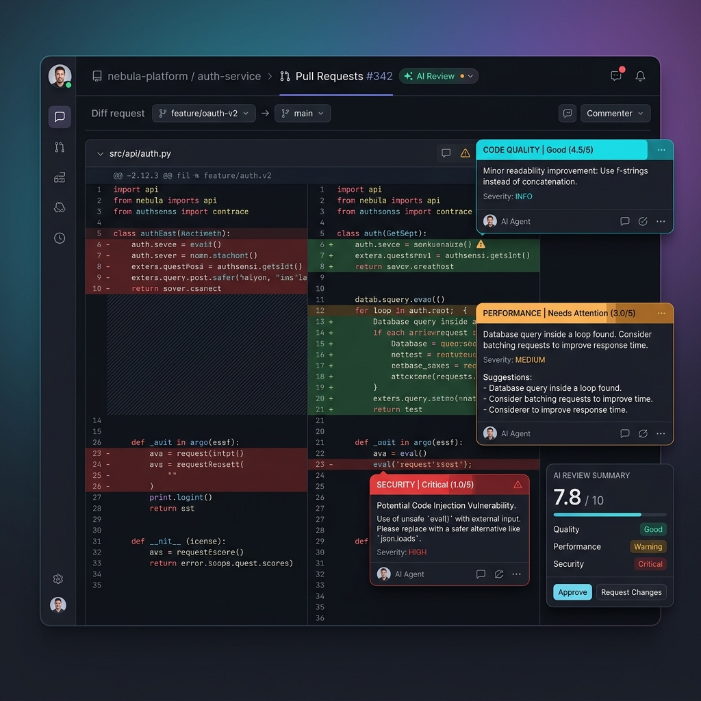
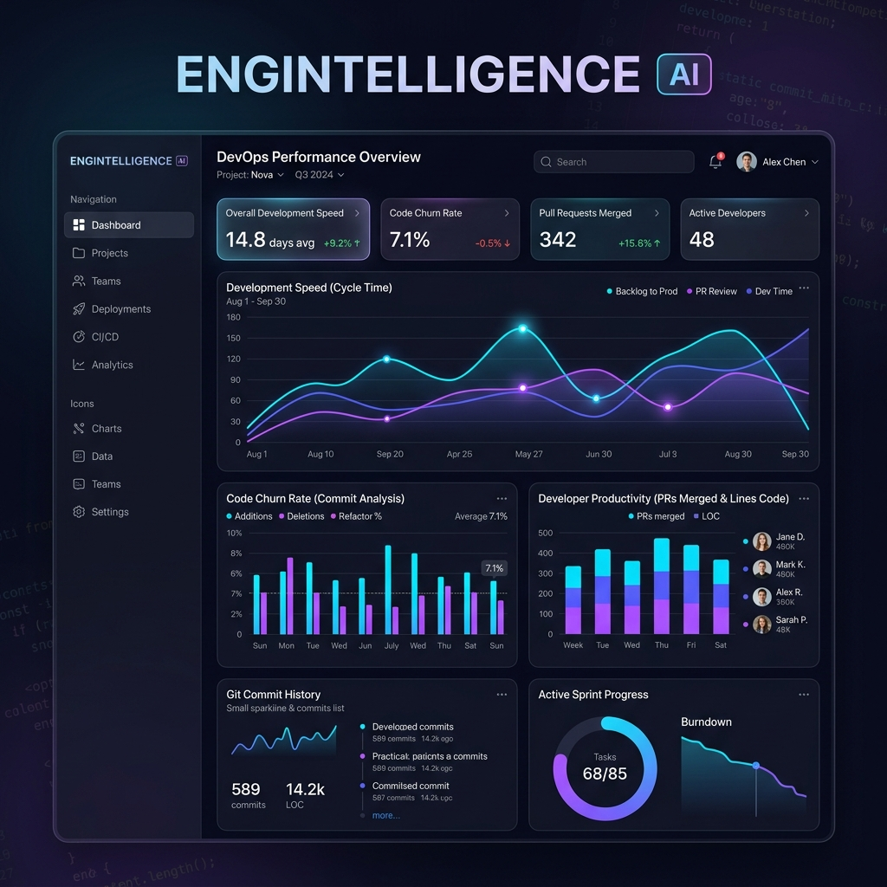
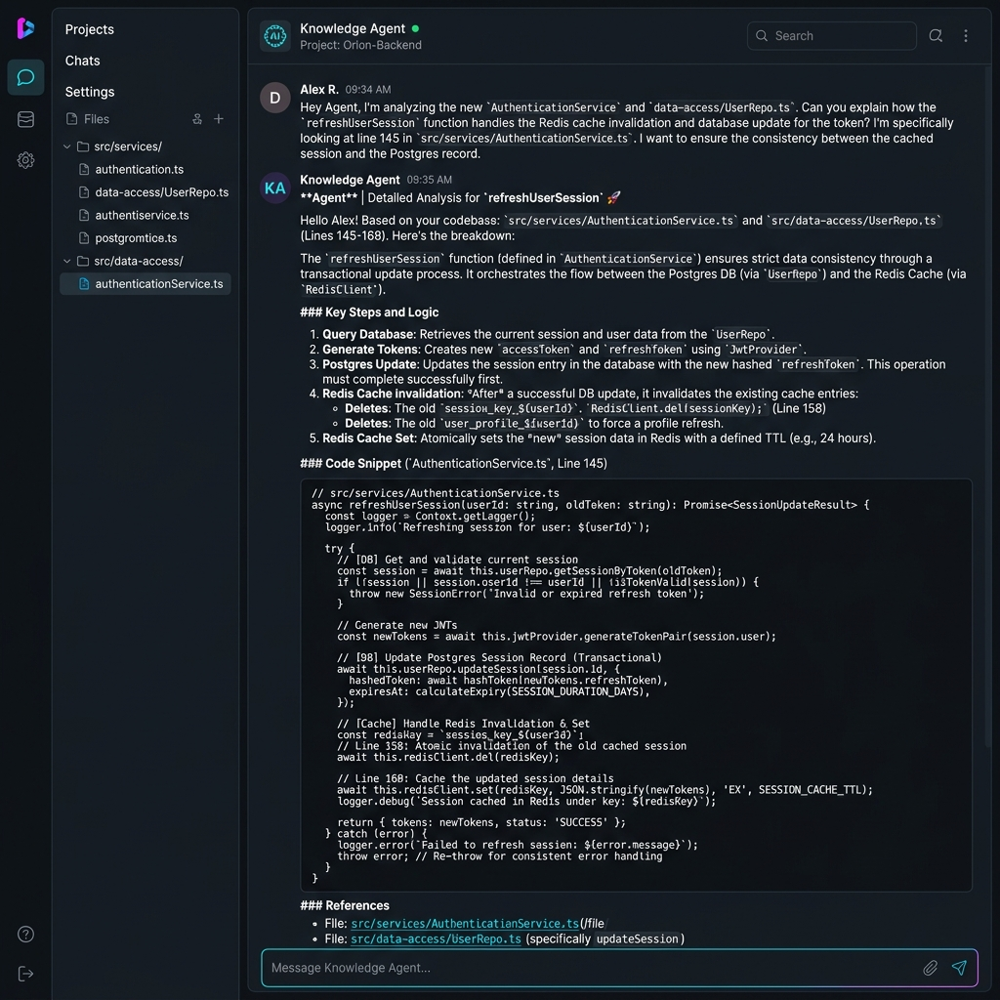
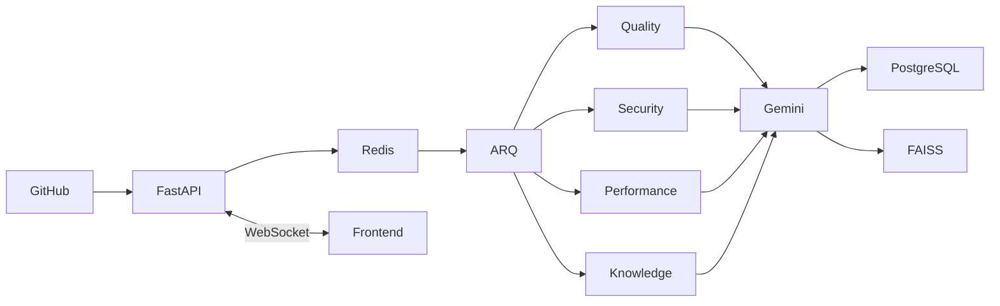
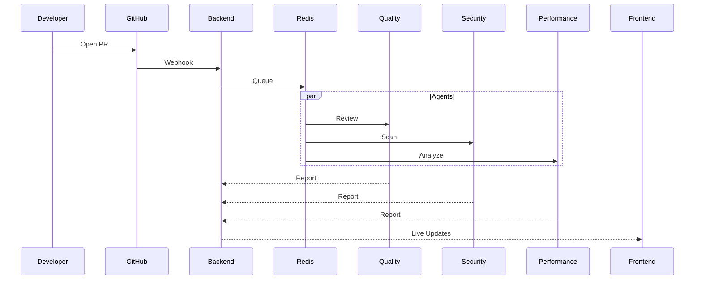

# 🚀 DevInsight

<p align="center">
  
</p>

<h1 align="center">DevInsight</h1>

<p align="center">
  <b>AI-Powered Engineering Intelligence Platform</b><br>
  Automated PR Reviews • Security Intelligence • Repository Analytics • Enterprise RAG
</p>

<p align="center">
  
</p>

<p align="center">


</p>

---

## ✨ Overview

DevInsight is an AI-powered engineering intelligence platform that continuously analyzes repositories, automates pull request reviews, detects security risks, performs AI-assisted root cause analysis, and powers an enterprise RAG knowledge assistant.

> Replace all images in `/assets` with your own screenshots/GIFs for the best presentation.

## 📸 Preview

| Dashboard | PR Review |
|-----------|-----------|
|  |  |

| Analytics | Knowledge Chat |
|-----------|----------------|
|  |  |

---

# 🌟 Key Features

| Feature | Description |
|---------|-------------|
| 🤖 Multi-Agent AI | Six concurrent AI agents |
| 🔒 Security | OWASP & secret detection |
| ⚡ Performance | Bottleneck analysis |
| 📊 Analytics | Engineering KPIs |
| 🧠 Enterprise RAG | Semantic repository search |
| 🔔 Live Updates | WebSocket notifications |

---

# 🏗️ Architecture



# 🔄 Pull Request Pipeline



# 🤖 AI Agents

| Agent | Responsibility |
|------|----------------|
| Code Quality | Clean code, complexity, maintainability |
| Security | Secrets, OWASP, dependency risks |
| Performance | Query, CPU, memory analysis |
| Bug Triage | Priority classification |
| Root Cause | Stack trace reasoning |
| Knowledge | RAG over docs and code |

<details>
<summary>📁 Project Structure</summary>

```text
devinsight/
├── backend/
│   ├── api/
│   ├── agents/
│   ├── rag/
│   ├── workers/
│   ├── models/
│   └── services/
├── frontend/
│   ├── routes/
│   ├── components/
│   ├── hooks/
│   ├── providers/
│   └── styles/
└── docker/
```
</details>

# ⚙️ Technology Stack

### Backend
- FastAPI
- PostgreSQL
- SQLAlchemy
- Alembic
- Redis
- ARQ
- FAISS
- sentence-transformers
- Gemini API

### Frontend
- React 19
- TanStack Start
- TypeScript
- Tailwind CSS
- Framer Motion
- Radix UI
- TanStack Query
- Recharts

# 🚀 Quick Start

```bash
git clone https://github.com/<your-username>/devinsight.git
cd devinsight
```

### Backend

```bash
cd backend
python -m venv .venv
pip install -r requirements.txt
alembic upgrade head
uvicorn app.main:app --reload
```

### Frontend

```bash
cd frontend
npm install
npm run dev
```

# 🔑 Environment Variables

```env
DATABASE_URL=
REDIS_URL=
SECRET_KEY=
GEMINI_API_KEY=
GITHUB_CLIENT_ID=
GITHUB_CLIENT_SECRET=
```

# 🗺️ Roadmap

- [x] AI PR Reviews
- [x] Security Analysis
- [x] Knowledge RAG
- [x] Live Dashboard
- [ ] Slack Integration
- [ ] Jira Integration
- [ ] Kubernetes Deployment
- [ ] Multi-Repository Comparison
- [ ] AI Release Notes

# 🤝 Contributing

1. Fork
2. Create a branch
3. Commit
4. Push
5. Open a Pull Request

# 📜 License

MIT

---

<p align="center">
Made with ❤️ using FastAPI • React • PostgreSQL • Redis • Gemini • FAISS

⭐ If you like this project, consider starring the repository.
</p>


<!-- Documentation placeholder section 1: add API reference, screenshots, deployment, FAQ, troubleshooting, CI/CD, benchmarks. -->

<!-- Documentation placeholder section 2: add API reference, screenshots, deployment, FAQ, troubleshooting, CI/CD, benchmarks. -->

<!-- Documentation placeholder section 3: add API reference, screenshots, deployment, FAQ, troubleshooting, CI/CD, benchmarks. -->

<!-- Documentation placeholder section 4: add API reference, screenshots, deployment, FAQ, troubleshooting, CI/CD, benchmarks. -->

<!-- Documentation placeholder section 5: add API reference, screenshots, deployment, FAQ, troubleshooting, CI/CD, benchmarks. -->

<!-- Documentation placeholder section 6: add API reference, screenshots, deployment, FAQ, troubleshooting, CI/CD, benchmarks. -->

<!-- Documentation placeholder section 7: add API reference, screenshots, deployment, FAQ, troubleshooting, CI/CD, benchmarks. -->

<!-- Documentation placeholder section 8: add API reference, screenshots, deployment, FAQ, troubleshooting, CI/CD, benchmarks. -->

<!-- Documentation placeholder section 9: add API reference, screenshots, deployment, FAQ, troubleshooting, CI/CD, benchmarks. -->

<!-- Documentation placeholder section 10: add API reference, screenshots, deployment, FAQ, troubleshooting, CI/CD, benchmarks. -->

<!-- Documentation placeholder section 11: add API reference, screenshots, deployment, FAQ, troubleshooting, CI/CD, benchmarks. -->

<!-- Documentation placeholder section 12: add API reference, screenshots, deployment, FAQ, troubleshooting, CI/CD, benchmarks. -->

<!-- Documentation placeholder section 13: add API reference, screenshots, deployment, FAQ, troubleshooting, CI/CD, benchmarks. -->

<!-- Documentation placeholder section 14: add API reference, screenshots, deployment, FAQ, troubleshooting, CI/CD, benchmarks. -->

<!-- Documentation placeholder section 15: add API reference, screenshots, deployment, FAQ, troubleshooting, CI/CD, benchmarks. -->

<!-- Documentation placeholder section 16: add API reference, screenshots, deployment, FAQ, troubleshooting, CI/CD, benchmarks. -->

<!-- Documentation placeholder section 17: add API reference, screenshots, deployment, FAQ, troubleshooting, CI/CD, benchmarks. -->

<!-- Documentation placeholder section 18: add API reference, screenshots, deployment, FAQ, troubleshooting, CI/CD, benchmarks. -->

<!-- Documentation placeholder section 19: add API reference, screenshots, deployment, FAQ, troubleshooting, CI/CD, benchmarks. -->

<!-- Documentation placeholder section 20: add API reference, screenshots, deployment, FAQ, troubleshooting, CI/CD, benchmarks. -->

<!-- Documentation placeholder section 21: add API reference, screenshots, deployment, FAQ, troubleshooting, CI/CD, benchmarks. -->

<!-- Documentation placeholder section 22: add API reference, screenshots, deployment, FAQ, troubleshooting, CI/CD, benchmarks. -->

<!-- Documentation placeholder section 23: add API reference, screenshots, deployment, FAQ, troubleshooting, CI/CD, benchmarks. -->

<!-- Documentation placeholder section 24: add API reference, screenshots, deployment, FAQ, troubleshooting, CI/CD, benchmarks. -->

<!-- Documentation placeholder section 25: add API reference, screenshots, deployment, FAQ, troubleshooting, CI/CD, benchmarks. -->

<!-- Documentation placeholder section 26: add API reference, screenshots, deployment, FAQ, troubleshooting, CI/CD, benchmarks. -->

<!-- Documentation placeholder section 27: add API reference, screenshots, deployment, FAQ, troubleshooting, CI/CD, benchmarks. -->

<!-- Documentation placeholder section 28: add API reference, screenshots, deployment, FAQ, troubleshooting, CI/CD, benchmarks. -->

<!-- Documentation placeholder section 29: add API reference, screenshots, deployment, FAQ, troubleshooting, CI/CD, benchmarks. -->

<!-- Documentation placeholder section 30: add API reference, screenshots, deployment, FAQ, troubleshooting, CI/CD, benchmarks. -->

<!-- Documentation placeholder section 31: add API reference, screenshots, deployment, FAQ, troubleshooting, CI/CD, benchmarks. -->

<!-- Documentation placeholder section 32: add API reference, screenshots, deployment, FAQ, troubleshooting, CI/CD, benchmarks. -->

<!-- Documentation placeholder section 33: add API reference, screenshots, deployment, FAQ, troubleshooting, CI/CD, benchmarks. -->

<!-- Documentation placeholder section 34: add API reference, screenshots, deployment, FAQ, troubleshooting, CI/CD, benchmarks. -->

<!-- Documentation placeholder section 35: add API reference, screenshots, deployment, FAQ, troubleshooting, CI/CD, benchmarks. -->

<!-- Documentation placeholder section 36: add API reference, screenshots, deployment, FAQ, troubleshooting, CI/CD, benchmarks. -->

<!-- Documentation placeholder section 37: add API reference, screenshots, deployment, FAQ, troubleshooting, CI/CD, benchmarks. -->

<!-- Documentation placeholder section 38: add API reference, screenshots, deployment, FAQ, troubleshooting, CI/CD, benchmarks. -->

<!-- Documentation placeholder section 39: add API reference, screenshots, deployment, FAQ, troubleshooting, CI/CD, benchmarks. -->

<!-- Documentation placeholder section 40: add API reference, screenshots, deployment, FAQ, troubleshooting, CI/CD, benchmarks. -->

<!-- Documentation placeholder section 41: add API reference, screenshots, deployment, FAQ, troubleshooting, CI/CD, benchmarks. -->

<!-- Documentation placeholder section 42: add API reference, screenshots, deployment, FAQ, troubleshooting, CI/CD, benchmarks. -->

<!-- Documentation placeholder section 43: add API reference, screenshots, deployment, FAQ, troubleshooting, CI/CD, benchmarks. -->

<!-- Documentation placeholder section 44: add API reference, screenshots, deployment, FAQ, troubleshooting, CI/CD, benchmarks. -->

<!-- Documentation placeholder section 45: add API reference, screenshots, deployment, FAQ, troubleshooting, CI/CD, benchmarks. -->

<!-- Documentation placeholder section 46: add API reference, screenshots, deployment, FAQ, troubleshooting, CI/CD, benchmarks. -->

<!-- Documentation placeholder section 47: add API reference, screenshots, deployment, FAQ, troubleshooting, CI/CD, benchmarks. -->

<!-- Documentation placeholder section 48: add API reference, screenshots, deployment, FAQ, troubleshooting, CI/CD, benchmarks. -->

<!-- Documentation placeholder section 49: add API reference, screenshots, deployment, FAQ, troubleshooting, CI/CD, benchmarks. -->

<!-- Documentation placeholder section 50: add API reference, screenshots, deployment, FAQ, troubleshooting, CI/CD, benchmarks. -->

<!-- Documentation placeholder section 51: add API reference, screenshots, deployment, FAQ, troubleshooting, CI/CD, benchmarks. -->

<!-- Documentation placeholder section 52: add API reference, screenshots, deployment, FAQ, troubleshooting, CI/CD, benchmarks. -->

<!-- Documentation placeholder section 53: add API reference, screenshots, deployment, FAQ, troubleshooting, CI/CD, benchmarks. -->

<!-- Documentation placeholder section 54: add API reference, screenshots, deployment, FAQ, troubleshooting, CI/CD, benchmarks. -->

<!-- Documentation placeholder section 55: add API reference, screenshots, deployment, FAQ, troubleshooting, CI/CD, benchmarks. -->

<!-- Documentation placeholder section 56: add API reference, screenshots, deployment, FAQ, troubleshooting, CI/CD, benchmarks. -->

<!-- Documentation placeholder section 57: add API reference, screenshots, deployment, FAQ, troubleshooting, CI/CD, benchmarks. -->

<!-- Documentation placeholder section 58: add API reference, screenshots, deployment, FAQ, troubleshooting, CI/CD, benchmarks. -->

<!-- Documentation placeholder section 59: add API reference, screenshots, deployment, FAQ, troubleshooting, CI/CD, benchmarks. -->

<!-- Documentation placeholder section 60: add API reference, screenshots, deployment, FAQ, troubleshooting, CI/CD, benchmarks. -->

<!-- Documentation placeholder section 61: add API reference, screenshots, deployment, FAQ, troubleshooting, CI/CD, benchmarks. -->

<!-- Documentation placeholder section 62: add API reference, screenshots, deployment, FAQ, troubleshooting, CI/CD, benchmarks. -->

<!-- Documentation placeholder section 63: add API reference, screenshots, deployment, FAQ, troubleshooting, CI/CD, benchmarks. -->

<!-- Documentation placeholder section 64: add API reference, screenshots, deployment, FAQ, troubleshooting, CI/CD, benchmarks. -->

<!-- Documentation placeholder section 65: add API reference, screenshots, deployment, FAQ, troubleshooting, CI/CD, benchmarks. -->

<!-- Documentation placeholder section 66: add API reference, screenshots, deployment, FAQ, troubleshooting, CI/CD, benchmarks. -->

<!-- Documentation placeholder section 67: add API reference, screenshots, deployment, FAQ, troubleshooting, CI/CD, benchmarks. -->

<!-- Documentation placeholder section 68: add API reference, screenshots, deployment, FAQ, troubleshooting, CI/CD, benchmarks. -->

<!-- Documentation placeholder section 69: add API reference, screenshots, deployment, FAQ, troubleshooting, CI/CD, benchmarks. -->

<!-- Documentation placeholder section 70: add API reference, screenshots, deployment, FAQ, troubleshooting, CI/CD, benchmarks. -->

<!-- Documentation placeholder section 71: add API reference, screenshots, deployment, FAQ, troubleshooting, CI/CD, benchmarks. -->

<!-- Documentation placeholder section 72: add API reference, screenshots, deployment, FAQ, troubleshooting, CI/CD, benchmarks. -->

<!-- Documentation placeholder section 73: add API reference, screenshots, deployment, FAQ, troubleshooting, CI/CD, benchmarks. -->

<!-- Documentation placeholder section 74: add API reference, screenshots, deployment, FAQ, troubleshooting, CI/CD, benchmarks. -->

<!-- Documentation placeholder section 75: add API reference, screenshots, deployment, FAQ, troubleshooting, CI/CD, benchmarks. -->

<!-- Documentation placeholder section 76: add API reference, screenshots, deployment, FAQ, troubleshooting, CI/CD, benchmarks. -->

<!-- Documentation placeholder section 77: add API reference, screenshots, deployment, FAQ, troubleshooting, CI/CD, benchmarks. -->

<!-- Documentation placeholder section 78: add API reference, screenshots, deployment, FAQ, troubleshooting, CI/CD, benchmarks. -->

<!-- Documentation placeholder section 79: add API reference, screenshots, deployment, FAQ, troubleshooting, CI/CD, benchmarks. -->

<!-- Documentation placeholder section 80: add API reference, screenshots, deployment, FAQ, troubleshooting, CI/CD, benchmarks. -->
