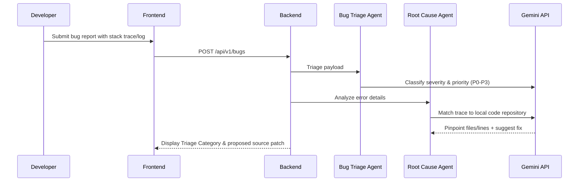
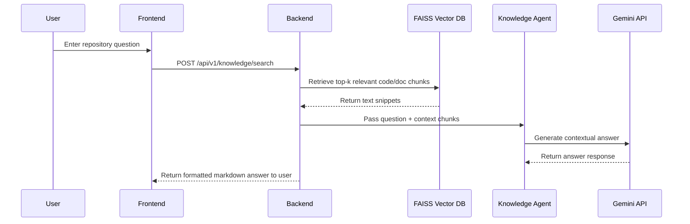

# DevInsight

[](LICENSE)
[](backend/)
[](frontend/)

**AI-powered Engineering Intelligence Platform — Automated Pull Request audits, repository health tracking, security risk alerts, and custom company knowledge RAG query engines.**

DevInsight integrates directly with GitHub to monitor repository activities, run 6 specialized AI agents concurrently for static analysis, index developer documentation inside a local FAISS semantic index, and deliver live analytics through a premium glassmorphic dashboard.

---

## 🛠️ Tech Stack & Architecture

DevInsight is divided into two distinct components: a FastAPI backend gateway and a TanStack Start React frontend.

```
devinsight/
├── backend/            ← FastAPI Gateway, SQLAlchemy DB Model, ARQ Background Worker, FAISS Index
└── frontend/           ← TanStack Start SSR App, Recharts analytics, Tailwind UI
```

### 1. Backend Gateway (`/backend`)
*   **Framework**: FastAPI (Python 3.12+) with asynchronous handlers and dependency injection.
*   **Database**: PostgreSQL 16 metadata storage + SQLAlchemy 2.0 (async connection pooling) + Alembic for migrations.
*   **Task Broker & Queue**: Redis 7 powering ARQ asynchronous worker queues.
*   **Embeddings & Search (RAG)**: `sentence-transformers/all-MiniLM-L6-v2` local transformer model for embedding generation + `FAISS` (in-process) vector database.
*   **AI Orchestration**: Google Gemini 2.5 Flash API connector.
*   **Real-time Communication**: FastAPI WebSockets for live status updates.

### 2. Client Frontend (`/frontend`)
*   **Core**: React 19 + TypeScript.
*   **App Framework**: TanStack Start (Vite 8 + TanStack Router for file-based routing and SSR support).
*   **Styling**: Tailwind CSS v4 + Framer Motion for micro-animations and smooth transitions.
*   **UI Components**: Radix UI + Lucide React + custom theme provider (Dark/Light mode).
*   **Data Fetching & State**: TanStack React Query.
*   **Data Visualizations**: Recharts for Area, Bar, and Line charts displaying codebase health metrics.

---

## 🚀 Key Features

*   **Engineering Dashboard**: High-level KPIs mapping repository health, security risks, open PRs, and team velocity.
*   **PR Review Queue**: Multi-agent code reviews evaluating Code Quality, Security, and Performance on unified diffs.
*   **Bug Triage & Root Cause Engine**: Automatic issue classification (P0–P3) and trace error analysis pinpointing source lines.
*   **Enterprise RAG Knowledge Base**: Semantic search and LLM context injection across custom uploaded company docs and indexed code.
*   **First-Time UX Guide**: Interactive walkthroughs to connect GitHub OAuth credentials and register active repositories.

---

## 🤖 Specialized AI Agents

DevInsight runs 6 specialized AI agents, orchestrated concurrently or sequentially depending on the event:

| Agent Name | Description | Key Capabilities |
|---|---|---|
| **Code Quality Agent** | Evaluates code structure, style, and code smells. | Checks readability, complexity, pattern adherence, and standard lint compliance. |
| **Security Agent** | Scans for potential vulnerability hazards. | Checks for credentials/secret leakage, OWASP Top 10 vulnerabilities, and dependency security risks. |
| **Performance Agent** | Analyzes performance bottlenecks. | Identifies potential latency issues, memory leaks, resource hogging, and inefficient database queries. |
| **Bug Triage Agent** | Categorizes and prioritizes issues. | Automatically triages issues/bugs, assigns severity (P0–P3), and adds relevant tags. |
| **Root Cause Agent** | Performs trace and logs error debugging. | Analyzes stack traces and error logs to pinpoint the exact line in code files and proposes fixes. |
| **Knowledge Agent** | Repository knowledge retrieval assistant. | Employs RAG (Retrieval-Augmented Generation) to query the codebase and local documentation for contextual answers. |

---

## 🔄 Core Workflows & Data Flows

### 1. Repository Connection & Initial Sync Flow

```mermaid
sequenceDiagram
    participant User
    participant Frontend
    participant Backend
    participant Redis Queue
    participant GitHub API
    participant FAISS Vector DB

    User->>Frontend: Connect Repository (OAuth)
    Frontend->>Backend: POST /api/v1/repositories/connect
    Backend->>Backend: Save Repo Metadata (PostgreSQL)
    Backend->>Redis Queue: Enqueue initial_sync_job
    Backend-->>Frontend: Connection pending status
    
    rect rgb(20, 20, 30)
        Note over Redis Queue, FAISS Vector DB: Async Sync Job
        Redis Queue->>GitHub API: Fetch files, PRs, and Issues
        GitHub API-->>Redis Queue: Return codebase text & logs
        Redis Queue->>FAISS Vector DB: Generate embeddings & index code files
        Redis Queue->>Backend: Mark sync job as complete
    end
    
    Backend->>Frontend: WebSocket Notification (Sync complete)
```


### 2. Pull Request Webhook & Multi-Agent Audit Flow

```mermaid
sequenceDiagram
    participant GitHub Webhook
    participant Backend
    participant Redis Queue
    participant AgentOrchestrator
    participant Gemini API
    participant Frontend

    GitHub Webhook->>Backend: POST /api/v1/webhooks/github (PR Open/Update)
    Backend->>Redis Queue: Enqueue pr_analysis_job
    
    rect rgb(20, 20, 30)
        Note over Redis Queue, Gemini API: Concurrently Analyze Diff
        Redis Queue->>AgentOrchestrator: Parse unified diff
        AgentOrchestrator->>Gemini API: Trigger Code Quality Agent
        AgentOrchestrator->>Gemini API: Trigger Security Agent
        AgentOrchestrator->>Gemini API: Trigger Performance Agent
        Gemini API-->>AgentOrchestrator: Return findings with severity levels
        AgentOrchestrator->>Backend: Persist findings to DB
    end

    Backend->>Frontend: Send WebSocket Update & real-time toast
    Backend->>GitHub Webhook: Post findings as review comments (optional)
```


### 3. Bug Reporting & Root Cause Identification Flow


### 4. RAG Semantic Querying Flow


---

## ⚡ Quick Start (Local Setup)

### Prerequisites
- **Python 3.12+**
- **Node.js 20+**
- **Docker & Docker Compose**
- **Google Gemini API Key** (Get one at [Google AI Studio](https://aistudio.google.com/))
- **GitHub OAuth App** (Set up under developer settings)

---

### Step-by-Step Installation

#### 1. Setup Backend
1. Navigate to `/backend`:
   ```bash
   cd backend
   ```
2. Copy environment file template:
   ```bash
   cp .env.example .env
   ```
   Fill in `.env` with:
   - `GEMINI_API_KEY`
   - `GITHUB_CLIENT_ID`
   - `GITHUB_CLIENT_SECRET`
   - `SECRET_KEY` (JWT sign secret)
3. Spin up PostgreSQL and Redis services:
   ```bash
   docker-compose up postgres redis -d
   ```
4. Configure python virtual environment & dependencies:
   ```bash
   python -m venv .venv
   source .venv/bin/activate  # On Windows: .venv\Scripts\activate
   pip install -r requirements.txt
   pip install -r requirements-dev.txt
   ```
5. Apply database schemas:
   ```bash
   alembic upgrade head
   ```
6. Launch servers (FastAPI + Background Worker):
   - Start FastAPI: `uvicorn app.main:app --reload --port 8000`
   - Start ARQ worker: `arq app.workers.settings.WorkerSettings`

---

#### 2. Setup Frontend
1. Navigate to `/frontend`:
   ```bash
   cd ../frontend
   ```
2. Install packages:
   ```bash
   npm install  # or bun install
   ```
3. Run the development server:
   ```bash
   npm run dev
   ```
4. Access the platform on `http://localhost:5173`.
